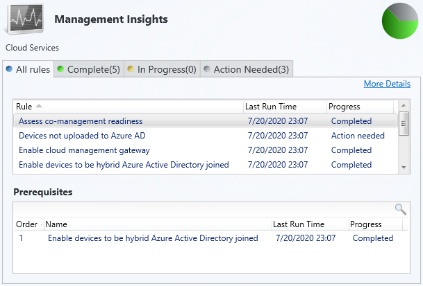

# Management insights in Configuration Manager

*Applies to: Configuration Manager (current branch)*

Management insights in Configuration Manager provide information about the current state of your environment. The information is based on analysis of data from the site database. Insights help you to better understand your environment and take action based on the insight.

## Review management insights

To view the insights, your account needs the **Read** permission on the **Site** object.

1. In the Configuration Manager console, go to the **Administration** workspace, expand **Management Insights**, and select **All Insights**.

   > [!NOTE]
   >
   > When you select the **Management Insights** node, it shows the [Management insights dashboard](#bkmk_insights).
2. Open the management insights group name you want to review.
3. In the ribbon, select **Show Insights**.

The following four tabs are available for review:

- **All Rules**: Gives the complete list of insights for the chosen group.
- **Complete**: Lists insights where no action is needed.
- **In Progress**: Shows insights where some, but not all, prerequisites are complete.
- **Action Needed**: This tab lists insights that need you to take action. Select **More Details** to show specific items where action is needed.

The **Prerequisites** pane lists any required items needed to run the selected insight.

For example, the following screenshot shows an example of the **All Rules** tab for the **Cloud Services** group:

To see the details, select an insight, and then select **More Details**.

## Operations

The site reevaluates the applicability of the management insights on a weekly schedule. To manually reevaluate an insight, right-click the insight, and select **Re-evaluate**.

The log file for management insights is **SMS_DataEngine.log** on the site server.

Some insights let you take action. Select an insight, select **More Details**, and then if available select **Take action**. Depending upon the insight, this action has one of the following behaviors:

- Automatically navigate in the console to the node where you can take further action. For example, if the management insight recommends changing a client setting, taking action navigates to the **Client Settings** node. Then take further action by modifying the default or a custom client settings object.
- Navigate to a filtered view based on a query. For example, taking action on the empty collections insight shows just these collections in the list of collections. Then take further action, such as deleting a collection or modifying its membership rules.

## Management insights dashboard

Select the **Management Insights** node to display a graphical dashboard. This dashboard displays an overview of the insight states, which makes it easier for you to show your progress.

Use the following filters at the top of the dashboard to refine the view:

- Show Completed
- Optional
- Recommended
- Critical

The dashboard includes the following tiles:

- **Management insights index**: Tracks overall progress on management insights. The index is a weighted average. Critical insights are worth the most. This index gives the least weight to optional insights.
- **Management insights groups**: Shows percent of insights in each group, honoring the filters. Select a group to drill down to the specific insights in this group.
- **Management insights priority**: Shows percent of insights by priority, honoring the filters.
- **Top 10 applicable insight rules**: A table of insights including priority and state. Use the **Filter** field at the top of the table to match strings in any of the available columns. The dashboard sorts the table in the following order:

  - Status: Action Needed, Completed, Unknown
  - Priority: Critical, Recommended, Optional
  - Last Changed: older dates on top

## Groups and insights

Insights are organized into the following management insight groups:

- [Applications](#applications)
- [Cloud services](#cloud-services)
- [Collections](#collections)
- [Configuration Manager Assessment](#configuration-manager-assessment)
- [Deprecated and unsupported features](#deprecated-and-unsupported-features)
- [Optimize for remote workers](#optimize-for-remote-workers)
- [Proactive maintenance](#proactive-maintenance)
- [Security](#security)
- [Simplified management](#simplified-management)
- [Software Center](#software-center)
- [Software updates](#software-updates)
- [Windows 10](#windows-10)

> [!NOTE]
>
> Your site may not show all of the following groups and insights. Some insights don't appear when you've already configured the site for the recommendation.

### Applications

Insights for your application management.

- **Applications without deployments or references**: Lists the applications in your environment that don't have active deployments or references. References include dependencies, task sequences, and virtual environments. This insight helps you find and delete unused applications to simplify the list of applications displayed in the console. For more information, see [Deploy applications](../../../apps/deploy-use/deploy-applications.md).

### Cloud services

Helps you integrate with many cloud services, which enable modern management of your devices.

- **Assess co-management readiness**: Helps you understand what steps are needed to enable co-management. This insight has prerequisites. For more information, see [Co-management overview](../../../comanage/overview.md).
- **Devices not uploaded to Microsoft Entra ID**: This insight lists devices that the site hasn't uploaded to Microsoft Entra ID because you haven't configured it for HTTPS. Configure [Enhanced HTTP](../../plan-design/hierarchy/enhanced-http.md), or enable at least one management point for HTTPS. If you already configured the site for HTTPS communication, this insight doesn't appear.
- **Enable cloud management gateway**: The cloud management gateway (CMG) provides a simple way to manage Configuration Manager clients over the internet. By deploying the CMG as a cloud service in Microsoft Azure, you can continue to manage and serve content to clients that roam onto the internet. With CMG, you don't need any additional on-premises infrastructure exposed to the internet. For more information, see [Overview of CMG](../../clients/manage/cmg/overview.md).
- **Enable devices to be Microsoft Entra hybrid joined**: Microsoft Entra joined devices allow users to sign in with their domain credentials, and make sure devices meet the organization's security and compliance standards. For more information, see [Microsoft Entra hybrid identity design considerations](https://learn.microsoft.com/en-us/azure/active-directory/hybrid/plan-hybrid-identity-design-considerations-overview).
- **Sites that don't have proper HTTPS configuration**: This insight lists sites in your hierarchy that aren't properly configured for HTTPS. This configuration prevents the site from [synchronizing collection membership results to Microsoft Entra groups](../../clients/manage/collections/create-collections.md#bkmk_aadcollsync). It may cause Microsoft Entra ID Sync to not upload all devices. Management of these clients may not function properly. Configure [Enhanced HTTP](../../plan-design/hierarchy/enhanced-http.md), or enable at least one management point for HTTPS. If you already configured the site for HTTPS communication, this insight doesn't appear.
- **Update clients to the latest Windows 10 version**: Windows 10, version 1709 or above improves and modernizes the computing experience of your users. For more information, see [Stay current with Windows as a service](../../understand/configuration-manager-and-windows-as-service.md#windows-as-a-service).

### Collections

Insights that help simplify management by cleaning up and reconfiguring collections.

- **Empty Collections**: Lists collections in your environment that have no members. For more information, see [How to manage collections](../../clients/manage/collections/manage-collections.md).

- **Collections with no query rules and no direct members**: To simplify the list of collections in your hierarchy, delete these collections.
- **Collections with the same re-evaluation start time**: These collections have the same re-evaluation time as other collections. Modify the re-evaluation time so they don't conflict.
- **Collections with query time over 5 minutes**: Review the query rules for this collection. Consider modifying or deleting the collection.
- The following insights include configurations that potentially cause unnecessary load on the site. Review these collections, then either delete them, or disable collection rule evaluation:

  - **Collections with no query rules and incremental updates enabled**
  - **Collections with no query rules and enabled for any schedule**
  - **Collections with no query rules and schedule full evaluation selected**

> [!NOTE]
>
> For more information on managing collections and collection evaluation, see the following articles:
>
> - [Best practices for collections](../../clients/manage/collections/best-practices-for-collections.md)
> - [Collection evaluation](../../clients/manage/collections/collection-evaluation.md)
> - [How to view collection evaluation](../../clients/manage/collections/collection-evaluation-view.md)

### Configuration Manager Assessment

This group is courtesy of Microsoft Premier Field Engineering. These insights are a sample of the many more checks that Microsoft Premier provides in the [Services Hub](https://learn.microsoft.com/en-us/services-hub/health/getting-started-with-on-demand-assessments).

- **Active Directory Security Group Discovery is configured to run too frequently**: You typically don't need to configure Active Directory Security Group Discovery to occur more frequently than every three hours. A more frequent configuration can have a negative performance impact on Active Directory, the network, and Configuration Manager. Enable incremental synchronization instead of using a full sync schedule. For more information, see [Active Directory group discovery](../deploy/configure/about-discovery-methods.md#bkmk_aboutGroup).
- **Active Directory System Discovery is configured to run too frequently**: You typically don't need to configure Active Directory System Discovery to occur more frequently than every three hours. A more frequent configuration can have a negative performance impact on Active Directory, the network, and Configuration Manager. Enable incremental synchronization instead of using a full sync schedule. For more information, see [Active Directory system discovery](../deploy/configure/about-discovery-methods.md#bkmk_aboutSystem).
- **Active Directory User Discovery is configured to run too frequently**: You typically don't need to configure Active Directory User Discovery to occur more frequently than every three hours. A more frequent configuration can have a negative performance impact on Active Directory, the network, and Configuration Manager. Enable incremental synchronization instead of using a full sync schedule. For more information, see [Active Directory user discovery](../deploy/configure/about-discovery-methods.md#bkmk_aboutUser).
- **Collections limited to All Systems or All Users**: Review any collections that use the **All Systems** or **All Users** collections as the limiting collection. Configuration Manager updates the membership of these default collections with data from the Active Directory discovery methods. This data may not be valid information for Configuration Manager clients.
- **Heartbeat Discovery is disabled**: Heartbeat discovery requires that you install the Configuration Manager client on devices. It's the only discovery method that clients start. All other methods occur on site servers. Heartbeat discovery is essential to keep client activity status current. It makes sure that the site doesn't accidentally age out the resource records from the site database. For more information, see [Heartbeat discovery](../deploy/configure/about-discovery-methods.md#bkmk_aboutHeartbeat).
- **Long running collection queries enabled for incremental updates**: Collections with a last incremental refresh time higher than 30 seconds use site server and database resources, which could potentially impact overall Configuration Manager performance. For more information, see [Best practices for collections](../../clients/manage/collections/best-practices-for-collections.md).
- **Reduce the number of applications and packages on distribution points**: Microsoft officially supports a combined total of up to 10,000 packages and applications on a distribution point. Exceeding this total can lead to operational problems. For more information, see [Size and scale numbers - distribution point](../../plan-design/configs/size-and-scale-numbers.md#distribution-point).
- **Secondary site installation issues**: The installation status of some secondary sites is **Pending** or **Failed**. These states mean that you started the install but it didn't complete successfully. Until the secondary site install finishes, clients may not communicate properly with the primary site. Check the **Monitoring** workspace, and retry the installation. For more information, see [Retry installation of a failed update](post-in-console-updates.md#retry-installation-of-a-failed-update).
- **Update all sites to the same version**: Use the same version of Configuration Manager in a hierarchy. This configuration makes sure all sites provide the same functionality. Sites of different versions in the same hierarchy introduce interoperability scenarios. Later versions of Configuration Manager include new features and resolve known issues. For more information, see [Interoperability between different versions](../../plan-design/hierarchy/interoperability-between-different-versions.md).

For more information on these insights, see [Remediation steps for Configuration Manager management insights](https://learn.microsoft.com/en-us/services-hub/health/remediation-steps-configmgr).

> [!TIP]
>
> If you're already a customer of Microsoft Unified or Microsoft Premier, sign in to the [Services Hub](https://serviceshub.microsoft.com/assessments/) for additional on-demand assessments.

### Deprecated and unsupported features

*(Introduced in version 2203)*

The following management insights are about features you may be using which have been deprecated or are no longer supported. These features may be removed from the product in a future release.

- **Site system roles associated with deprecated or removed features**: This insight checks for installed site system roles for deprecated features that will be removed in a future release.
- **Check if the site uses the asset intelligence sync point role**: This insight checks for installation of the asset intelligence synchronization point role.
- **Configuration Manager client for macOS end of support**: This insight lists the clients running macOS. Support for the Configuration Manager client for macOS and Mac client management ends on December 31, 2022.
- **Certificate registration point is no longer supported**: This insight checks for installation of the certificate registration point site system role. This feature is no longer supported as of March 2022. Configuration Manager versions released before March 2022 will still be able to install and use certificate registration points.
- **Company resource access policies are no longer supported**: This insight checks for company resource access policies. These features are no longer supported as of March 2022. Company resource access includes email, certificate, VPN, Wi-Fi, and Windows Hello for Business profiles. Configuration Manager versions released before March 2022 will still be able to use company resource access policies.
- **Microsoft Store for Business deprecated**: This insight checks for the presence of Microsoft Store for Business connector. This feature has been deprecated as of Nov 2021.

### Operating system deployment

The following management insights help you manage the policy size of task sequences. When the size of the task sequence policy exceeds 32 MB, the client fails to process the large policy. The client then fails to run the task sequence deployment.

- **Large task sequences may contribute to exceeding maximum policy size**: If you deploy these task sequences, clients may not be able to process the large policy objects. Reduce the size of the task sequence policy to prevent potential policy processing issues.
- **Total policy size for task sequences exceeds policy limit**: Clients can't process the policy for these task sequences because it's too large. Reduce the size of the task sequence policy to allow the deployment to run on clients.

For more information, see [Reduce the size of task sequence policy](../../../osd/deploy-use/reduce-task-sequence-policy-size.md).

This group also includes the following insight:

- **Unused boot images**: Boot images not referenced for PXE boot or task sequence use. For more information, see [Manage boot images](../../../osd/get-started/manage-boot-images.md).

### Optimize for remote workers

Starting in version 2006, the following insights help you create better experiences for remote workers and reduce load on your infrastructure:

- **Configure VPN connected clients to prefer cloud based content sources**: To reduce traffic on the VPN, enable the boundary group option to **Prefer cloud based sources over on-premises sources**. This option allows clients to download content from the internet instead of distribution points across the VPN. For more information, see [Boundary group options](../deploy/configure/boundary-group-options.md).
- **Define VPN boundary groups**: Create a VPN boundary and associate it to a boundary group. Associate VPN-specific site systems to the group, and configure the settings for your environment. This insight checks for at least one boundary group with at least one VPN boundary in it. From the properties of this insight, select **Review Actions** to go to the **Boundary Groups** node. For more information, see [VPN boundary type](../deploy/configure/boundaries.md#vpn).
- **Disable peer to peer content sharing for VPN connected clients**: To prevent unnecessary peer-to-peer traffic that likely doesn't benefit the remote clients, disable the boundary group option to **Allow peer downloads in this boundary group**. For more information, see [Boundary group options](../deploy/configure/boundary-group-options.md).

### Proactive maintenance

The insights in this group highlight potential configuration issues to avoid through upkeep of Configuration Manager objects.

- **Boundary groups with no assigned site systems**: Without assigned site systems, boundary groups can only be used for site assignment. For more information, see [Configure boundary groups](../deploy/configure/boundary-groups.md).
- **Boundary groups with no members**: Boundary groups aren't applicable for site assignment or content lookup if they don't have any members. For more information, see [Configure boundary groups](../deploy/configure/boundary-groups.md).
- **Distribution points not serving content to clients**: Distribution points that haven't served content to clients in the past 30 days. This data is based on reports from clients of their download history. For more information, see [Install and configure distribution points](../deploy/configure/install-and-configure-distribution-points.md).
- **Enable WSUS Cleanup**: Verifies that you've enabled the option to run WSUS cleanup on the properties of the software update point component. This option helps to improve WSUS performance. For more information, see [Software update maintenance](../../../sum/deploy-use/software-updates-maintenance.md).
- **Unused configuration items**: Configuration items that aren't part of a configuration baseline and are older than 30 days. For more information, see [Create configuration baselines](../../../compliance/deploy-use/create-configuration-baselines.md).
- **Update Microsoft .NET Framework on site systems**: Starting in version 2107, Configuration Manager requires Microsoft .NET Framework version 4.6.2 for site servers, specific site systems, clients, and the console. Before you run setup to install or update the site, first update .NET and restart the system. If possible in your environment, install the latest version of .NET version 4.8. For more information, [Site and site system prerequisites](../../plan-design/configs/site-and-site-system-prerequisites.md#net-version-requirements).
- **Update servers running Windows Server 2012 and 2012 R2**: Detects servers that are running Windows Server 2012 or 2012 R2 operating systems. The support lifecycle for these operating systems ended on October 9, 2023. For more information, see the [Product lifecycle](https://learn.microsoft.com/en-us/lifecycle/announcements/sql-server-2012-windows-server-2012-end-of-support).
- **Upgrade peer cache sources to the latest version of the Configuration Manager client**: Identify clients that serve as a peer cache source but haven't upgraded from a pre-1806 client version. Pre-1806 clients can't be used as a peer cache source for clients that run version 1806 or later. Select **Take action** to open a device view that displays the list of clients.

> [!TIP]
>
> In version 2006, the insight for **Unused boot images** moved to the new [OS deployment](#operating-system-deployment) group.

### Security

Insights for improving the security of your infrastructure and devices.

- **NTLM fallback is enabled**: This insight detects if you enabled the less secure NTLM authentication fallback method for the site. When using the client push method of installing the Configuration Manager client, the site can require Kerberos mutual authentication. This enhancement helps to secure the communication between the server and the client. For more information, see [How to install clients with client push](../../clients/deploy/deploy-clients-to-windows-computers.md#BKMK_ClientPush).
- **Unsupported antimalware client versions**: More than 10% of clients are running versions of System Center Endpoint Protection that aren't supported. For more information, see [Endpoint Protection](../../../protect/deploy-use/endpoint-protection.md).
- **Update clients running Windows 7 and Windows Server 2008**: The rule shows clients running Windows 7, Windows Server 2008 (non-Azure), and Windows Server 2008 R2 (non-Azure) that are no longer receiving security updates. For more information about updates for these operating systems, see [Extended Security Updates (ESU)](https://support.microsoft.com/help/4497181/lifecycle-faq-extended-security-updates).

### Simplified management

Insights that help you simplify the day-to-day management of your environment.

- **Connect the site to the Microsoft cloud for Configuration Manager updates**: This insight makes sure your Configuration Manager service connection point has connected to the Microsoft cloud within the past seven days. This connection is to download content for regular updates. Review DMPDownloader.log and hman.log. For more information, see [Internet access requirements](../../plan-design/network/internet-endpoints.md#updates-and-servicing).
- **Non-CB Client Versions**: Lists all clients whose versions aren't a current branch (CB) build. For more information, see [Upgrade clients](../../clients/manage/upgrade/upgrade-clients.md).
- **Update clients to a supported Windows 10 version**: This insight reports on clients that are running a version of Windows 10 that's no longer supported.

### Software Center

Insights for managing Software Center.

- **Direct users to Software Center instead of Application Catalog**: Check if users have installed or requested applications from the application catalog in the last 14 days. The primary functionality of application catalog is now included in Software Center. Support for the application catalog roles ended with version 1910. For more information, see [Deprecated features](../../plan-design/changes/deprecated/removed-and-deprecated-cmfeatures.md#deprecated-features).
- **Use the new version of Software Center**: The previous version of Software Center is no longer supported. Set up clients to use the new Software Center by enabling the client setting **Use new Software Center** in the **Computer Agent** group. For more information, see [About client settings](../../clients/deploy/about-client-settings.md#use-new-software-center).

### Software updates

- **Client settings aren't configured to allow clients to download delta content**: Some software updates synchronized in your environment include delta content. Enable the client setting, **Allow clients to download delta content when available**. If you don't enable this setting, when you deploy these updates, client will unnecessarily download more content than they require. For more information, see [Client settings - Software updates](../../clients/deploy/about-client-settings.md#software-updates).
- **Enable the software updates product category 'Windows 10, version 1903 and later'**: There's a new software updates product category for Windows 10, version 1903 and later. If you synchronize Windows 10 updates, and have Windows 10, version 1903 or later clients, select the **Windows 10, version 1903 and later** product category in the software update point component properties. For more information, see[Configure classifications and products to synchronize](../../../sum/get-started/configure-classifications-and-products.md).
- **Configure software update points to use TLS/SSL**: Detects if your software update points are [configured to use TLS/SSL](../../../sum/get-started/software-update-point-ssl.md). Configuring Windows Server Update Services (WSUS) servers and their corresponding software update points (SUPs) to use TLS/SSL may reduce the ability of a potential attacker to remotely compromise a client and elevate privileges. This rule was added in Configuration Manager version 2107.

### Windows 10

Insights related to the deployment and servicing of Windows 10. The Windows 10 management insight group is only available when more than half of clients are running Windows 7, Windows 8, or Windows 8.1.

- **Configure Windows diagnostic data and commercial ID key**: To use data from Desktop Analytics, configure devices with a Commercial ID key and enable collection of diagnostic data. Set Windows 10 devices to **Enhanced (Limited)** level or higher.
